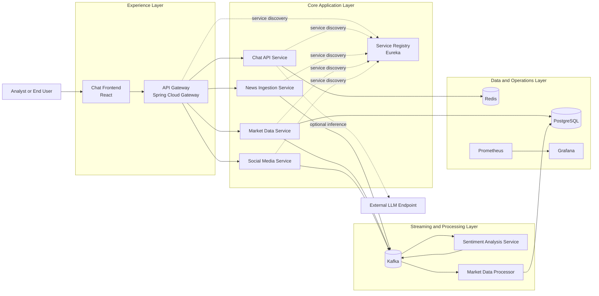
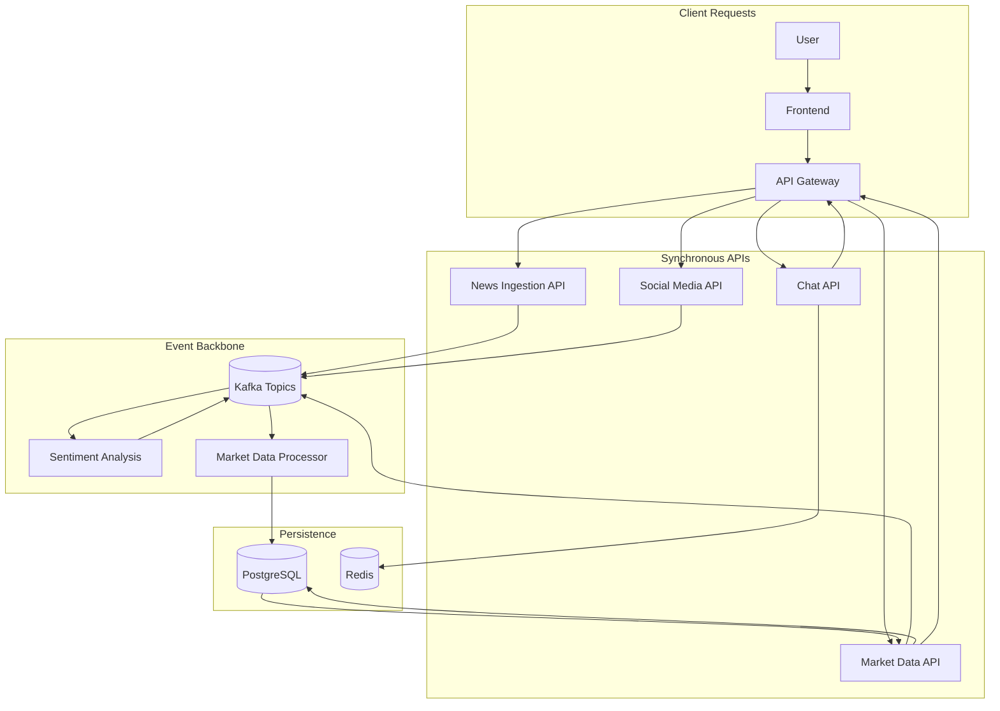
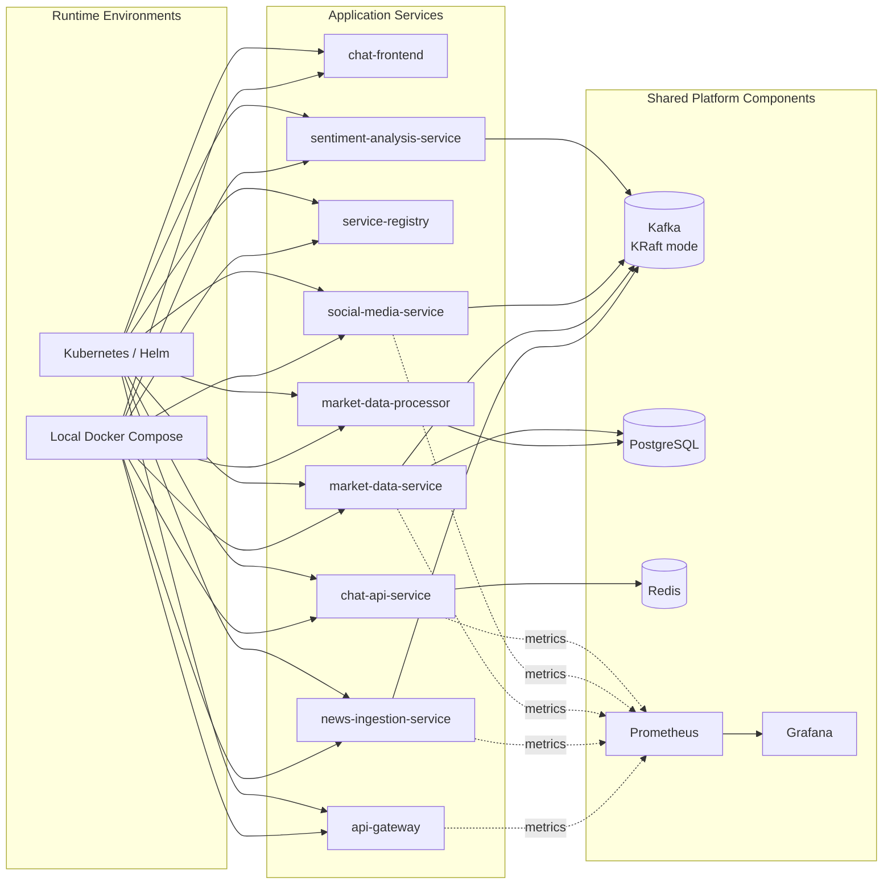

# Architecture Overview

## System Design

The market-analysis platform is an enterprise-style microservices system built to ingest, process, and analyse financial market data in near real-time, with an LLM-powered chat interface for user queries.

## End-to-End Runtime Flow

## Platform and Deployment View

## Service Catalogue

| Service | Port | Technology | Role |
|---------|------|------------|------|
| `service-registry` | 8761 | Spring Cloud Eureka | Service discovery |
| `api-gateway` | 8080 | Spring Cloud Gateway | Routing, load balancing |
| `news-ingestion-service` | 8081 | Spring Boot + Kafka | Financial news producer |
| `market-data-service` | 8082 | Spring Boot + JPA | Quote data REST + Kafka |
| `social-media-service` | 8083 | Spring Boot + Kafka | Social signals producer |
| `chat-api-service` | 8085 | Spring Boot + Redis | LLM chat API |
| `sentiment-analysis-service` | 8086 | Python + FastAPI | Kafka consumer, NLP |
| `market-data-processor` | 8087 | Python + FastAPI | Kafka consumer, DB writer |
| `chat-frontend` | 3000 | React | User interface |

## Data Flow

1. **Ingestion** – `news-ingestion-service` and `social-media-service` produce events to Kafka topics.
2. **Processing** – `sentiment-analysis-service` consumes raw topics, scores sentiment, publishes to `market.sentiment.scores`.
3. **Persistence** – `market-data-processor` consumes quotes and sentiment scores, writes to PostgreSQL.
4. **Query** – `market-data-service` exposes REST endpoints backed by PostgreSQL.
5. **Chat** – `chat-api-service` accepts user queries, optionally calls an LLM, caches history in Redis.
6. **Observability** – All Spring Boot services expose `/actuator/prometheus`; Prometheus scrapes + Grafana visualises.
