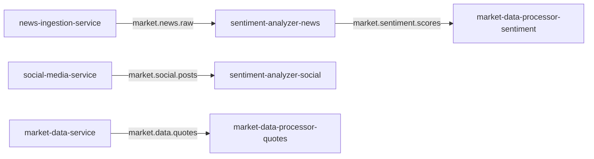

# Kafka Topics

## Topic Definitions

| Topic | Partitions | Retention | Producer | Consumer(s) |
|-------|-----------|-----------|----------|-------------|
| `market.news.raw` | 3 | 7 days | news-ingestion-service | sentiment-analysis-service |
| `market.social.posts` | 3 | 7 days | social-media-service | sentiment-analysis-service |
| `market.data.quotes` | 6 | 3 days | market-data-service | market-data-processor |
| `market.sentiment.scores` | 3 | 7 days | sentiment-analysis-service | market-data-processor |

## Message Schemas

### `market.news.raw`
```json
{
  "id": "uuid",
  "title": "string",
  "content": "string",
  "source": "string",
  "url": "string",
  "publishedAt": "ISO-8601",
  "ticker": "string"
}
```

### `market.data.quotes`
```json
{
  "id": "uuid",
  "ticker": "string",
  "price": "decimal",
  "changePercent": "decimal",
  "volume": "integer",
  "timestamp": "ISO-8601"
}
```

### `market.sentiment.scores`
```json
{
  "source_topic": "string",
  "ticker": "string",
  "text_preview": "string",
  "sentiment": "POSITIVE|NEGATIVE|NEUTRAL",
  "score": "float [-1, 1]"
}
```

## Creating Topics

```bash
# Using the helper script
bash infra/kafka/create-topics.sh
```

## Consumer Groups


