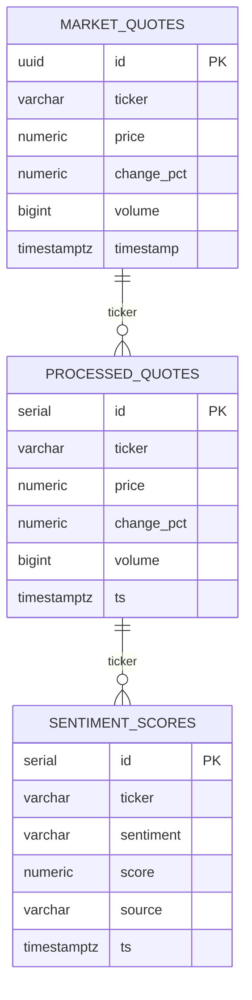

# Database Schema

## Tables

### `market_quotes` (Spring Boot JPA)

| Column | Type | Notes |
|--------|------|-------|
| `id` | UUID PK | Auto-generated |
| `ticker` | VARCHAR(10) | Stock symbol |
| `price` | NUMERIC(18,4) | Bid/mid price |
| `change_pct` | NUMERIC(18,4) | % change |
| `volume` | BIGINT | Trading volume |
| `timestamp` | TIMESTAMPTZ | Quote time |
| `created_at` | TIMESTAMPTZ | DB insert time |

### `processed_quotes` (Python processor)

| Column | Type | Notes |
|--------|------|-------|
| `id` | SERIAL PK | |
| `ticker` | VARCHAR(10) | |
| `price` | NUMERIC(18,4) | |
| `change_pct` | NUMERIC(18,4) | |
| `volume` | BIGINT | |
| `ts` | TIMESTAMPTZ | Kafka message time |
| `created_at` | TIMESTAMPTZ | |

### `sentiment_scores`

| Column | Type | Notes |
|--------|------|-------|
| `id` | SERIAL PK | |
| `ticker` | VARCHAR(10) | |
| `sentiment` | VARCHAR(20) | POSITIVE/NEGATIVE/NEUTRAL |
| `score` | NUMERIC(6,4) | Range -1 to 1 |
| `source` | VARCHAR(50) | Originating Kafka topic |
| `ts` | TIMESTAMPTZ | |

## ER Diagram

