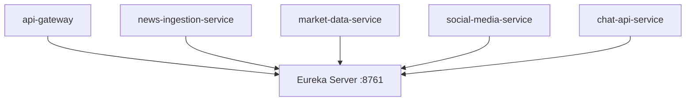

# Service Registry

The service registry uses **Netflix Eureka** (via Spring Cloud) for service discovery.

## Configuration

All microservices register themselves on startup:

```yaml
eureka:
  client:
    service-url:
      defaultZone: http://service-registry:8761/eureka/
```

## Dashboard

Accessible at `http://localhost:8761` when running locally.



## Health Check

```bash
curl http://localhost:8761/actuator/health
```
