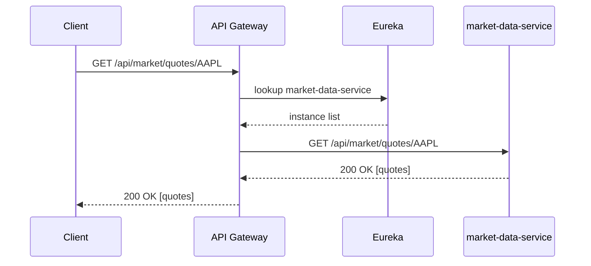

# API Gateway

The API Gateway uses **Spring Cloud Gateway** for routing, load balancing, and cross-cutting concerns.

## Routes

| Route ID | Path Prefix | Backend Service |
|----------|-------------|-----------------|
| `news-ingestion` | `/api/news/**` | `lb://news-ingestion-service` |
| `market-data` | `/api/market/**` | `lb://market-data-service` |
| `social-media` | `/api/social/**` | `lb://social-media-service` |
| `chat-api` | `/api/chat/**` | `lb://chat-api-service` |

## Load Balancing

Routes use the `lb://` scheme which integrates with Eureka for client-side load balancing via Spring Cloud LoadBalancer.

## Configuration

```yaml
spring:
  cloud:
    gateway:
      discovery:
        locator:
          enabled: true
          lower-case-service-id: true
```

## Sequence Diagram


