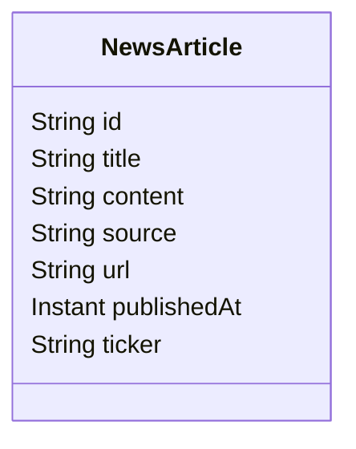
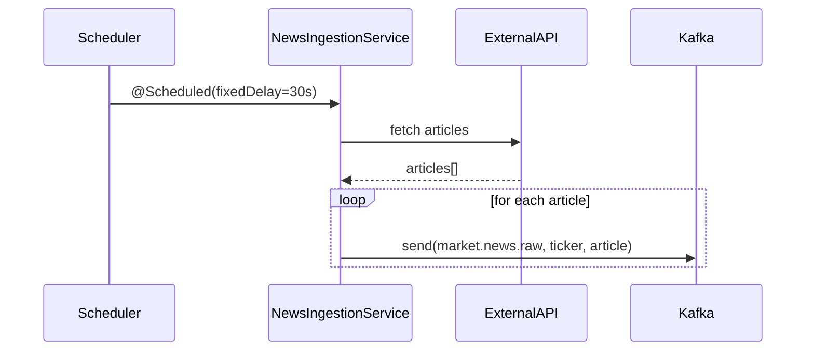

# News Ingestion Service

## Responsibilities

- Polls (or simulates) financial news sources on a 30-second schedule.
- Publishes `NewsArticle` events to the `market.news.raw` Kafka topic.
- Exposes a REST endpoint to trigger manual ingestion.

## Data Model

## Kafka Producer

Messages are keyed by `ticker` symbol, enabling partition-level ordering per stock.

## Extension Points

To connect a real news API (e.g. Finnhub, NewsAPI), replace `fetchDemoArticles()` in `NewsIngestionService.java` with an `RestTemplate` or `WebClient` call.
