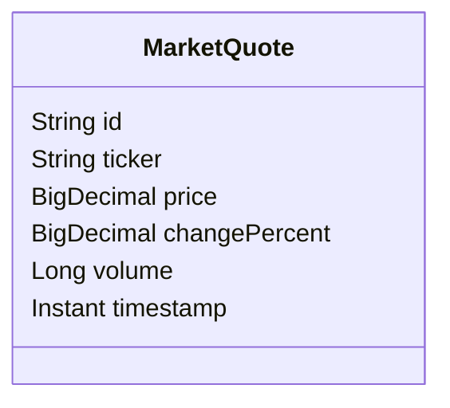

# Market Data Service

## Responsibilities

- Generates (or fetches) real-time stock quotes.
- Persists quotes to PostgreSQL via Spring Data JPA.
- Publishes `MarketQuote` events to `market.data.quotes` Kafka topic.
- Exposes a REST API for querying recent quotes.

## Data Model

## Scheduling

Quotes are published every 10 seconds for all tracked tickers: AAPL, MSFT, GOOGL, AMZN, TSLA, SPY, QQQ.

## REST API

| Method | Path | Description |
|--------|------|-------------|
| GET | `/api/market/quotes/{ticker}` | Last 10 quotes |
| POST | `/api/market/quotes/refresh` | Force refresh |

## Extension Points

Replace `generateQuote()` in `MarketDataService.java` with a call to a real market data provider (e.g. Alpha Vantage, Polygon.io).
