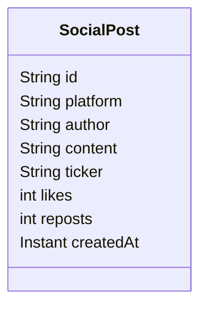

# Social Media Service

## Responsibilities

- Simulates ingestion of social media posts (Twitter/X, Reddit, StockTwits).
- Publishes `SocialPost` events to `market.social.posts` Kafka topic every 20 seconds.

## Data Model

## Kafka Producer

Posts are keyed by `ticker`, allowing downstream consumers to partition by stock.

## Extension Points

Replace `DEMO_POSTS` with real API calls:
- **Twitter/X**: OAuth2 authentication + filtered stream API
- **Reddit**: PRAW (Python Reddit API Wrapper) or REST `/r/wallstreetbets`
- **StockTwits**: Public REST API at `api.stocktwits.com`
