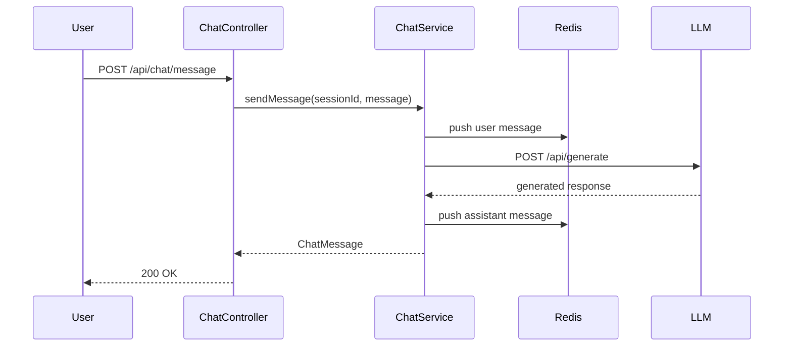

# Chat API Service

## Responsibilities

- Accepts user messages via REST (`POST /api/chat/message`).
- Stores conversation history in Redis with configurable TTL.
- Delegates response generation to an LLM endpoint (Ollama-compatible).
- Falls back to deterministic demo responses when the LLM is unavailable.

## Architecture



## Redis Session Storage

- Key: `chat:session:{sessionId}`
- Type: Redis List (FIFO message history)
- TTL: 3600 seconds (configurable)
- Max messages: 50 per session (configurable)

## LLM Integration

Configure via environment variables:

```yaml
chat:
  llm:
    endpoint: http://ollama:11434/api/generate
    model: llama3
```

Compatible with any Ollama-hosted model. The service degrades gracefully if the LLM endpoint is unreachable.
