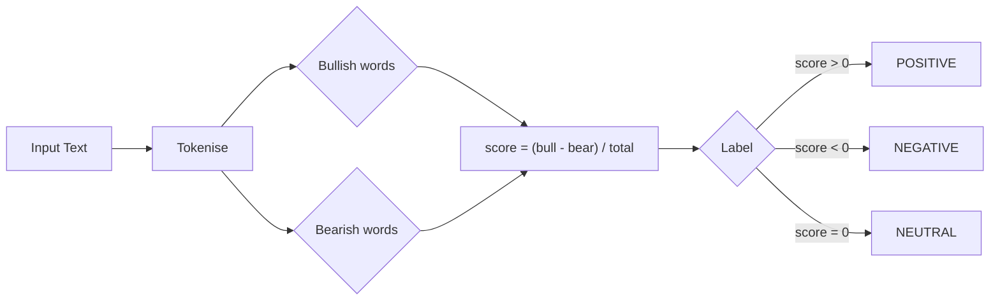

# Sentiment Analysis Service

## Responsibilities

- Consumes `market.news.raw` and `market.social.posts` Kafka topics.
- Scores each message using a lexicon-based sentiment model.
- Publishes scored results to `market.sentiment.scores`.
- Exposes a synchronous `/analyze` REST endpoint.

## Sentiment Algorithm

The service uses a lexicon approach (no ML model download required for demo):



## Extending to ML-based Sentiment

Swap `analyze_sentiment()` in `main.py` with a HuggingFace `pipeline`:

```python
from transformers import pipeline
classifier = pipeline("text-classification", model="ProsusAI/finbert")

def analyze_sentiment(text: str) -> dict:
    result = classifier(text[:512])[0]
    return {"label": result["label"], "score": result["score"]}
```

## Consumer Groups

| Topic | Consumer Group |
|-------|---------------|
| `market.news.raw` | `sentiment-analyzer-market.news.raw` |
| `market.social.posts` | `sentiment-analyzer-market.social.posts` |
