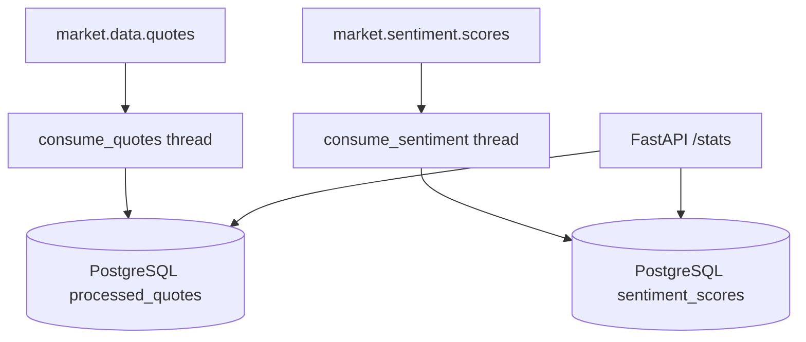

# Market Data Processor

## Responsibilities

- Consumes `market.data.quotes` and persists to `processed_quotes` table.
- Consumes `market.sentiment.scores` and persists to `sentiment_scores` table.
- Exposes a `/stats/{ticker}` REST endpoint with aggregated statistics.

## Architecture



## Database Initialisation

On startup, the service runs `CREATE TABLE IF NOT EXISTS` for both tables, ensuring idempotent initialisation.

## Stats Endpoint

```bash
curl http://localhost:8087/stats/AAPL
```

```json
{
  "ticker": "AAPL",
  "avg_price": 191.25,
  "avg_sentiment": 0.35,
  "record_count": 1200
}
```
