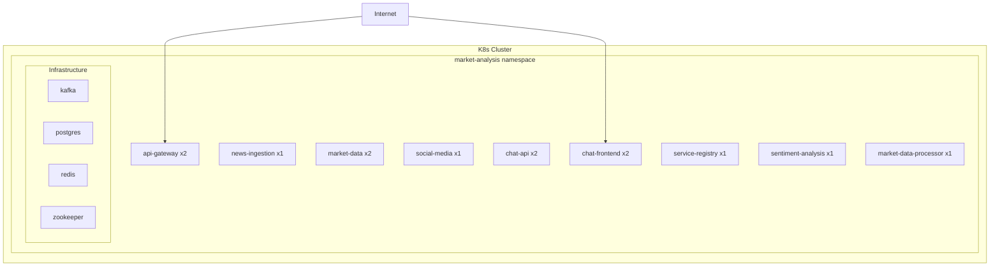

# Kubernetes Deployment

## Overview

The platform ships with production-ready Kubernetes manifests in the `k8s/` directory.

## Files

| File | Description |
|------|-------------|
| `00-namespace.yml` | Namespace, ConfigMap, Secrets |
| `01-infrastructure.yml` | Zookeeper, Kafka, PostgreSQL |
| `02-services.yml` | All application microservices |

## Deploying

```bash
# Apply all manifests in order
kubectl apply -f k8s/00-namespace.yml
kubectl apply -f k8s/01-infrastructure.yml
kubectl apply -f k8s/02-services.yml
```

## Namespace

All resources are deployed to the `market-analysis` namespace.

## Architecture Diagram



## Scaling

```bash
kubectl scale deployment market-data --replicas=4 -n market-analysis
```
