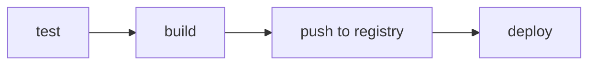

# CI/CD Pipeline

## Overview

The GitLab CI/CD pipeline (`.gitlab-ci.yml`) automates testing, building, and deploying the platform.

## Stages



## Pipeline Matrix

| Stage | Jobs |
|-------|------|
| test | service-registry, api-gateway, news-ingestion, market-data, social-media, chat-api, sentiment-analysis, market-data-processor, frontend |
| build | Same services + frontend Docker images |
| deploy | staging (auto on `develop`), production (manual on `main`) |

## Environment Variables

Set the following CI/CD variables in GitLab:

| Variable | Description |
|----------|-------------|
| `CI_REGISTRY` | Docker registry URL |
| `CI_REGISTRY_USER` | Registry username |
| `CI_REGISTRY_PASSWORD` | Registry password |

## Deployment Strategy

- **Staging**: Auto-deployed on every push to `develop` via `helm upgrade --install`.
- **Production**: Manual gate on `main` branch to prevent accidental deployments.

## Extending

Add quality gates:
```yaml
sonarqube:
  stage: test
  image: sonarsource/sonar-scanner-cli
  script:
    - sonar-scanner -Dsonar.projectKey=market-analysis
```
