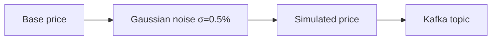

# Demo Data Generators

## Overview

`demo-data-generators/generate_market_data.py` produces a continuous stream of synthetic market data for local development and demos.

## What It Generates

| Event | Topic | Interval |
|-------|-------|----------|
| Market quotes | `market.data.quotes` | Every 2 seconds |
| News articles | `market.news.raw` | Every 10 seconds |
| Social posts | `market.social.posts` | Every 6 seconds |

## Running

```bash
cd demo-data-generators
pip install -r requirements.txt

# Default: connects to localhost:9092
python generate_market_data.py

# Custom Kafka endpoint
KAFKA_BOOTSTRAP_SERVERS=kafka:9092 python generate_market_data.py
```

## Tickers

Data is generated for: `AAPL`, `MSFT`, `GOOGL`, `AMZN`, `TSLA`, `NVDA`, `SPY`, `QQQ`, `META`, `NFLX`

## Price Simulation

Prices follow a Gaussian random walk anchored to realistic base prices:



## Extending

Add more realistic market microstructure by implementing:
- Bid-ask spread simulation
- Intraday volume patterns (higher open/close)
- Correlated asset movements
- Earnings event simulation
